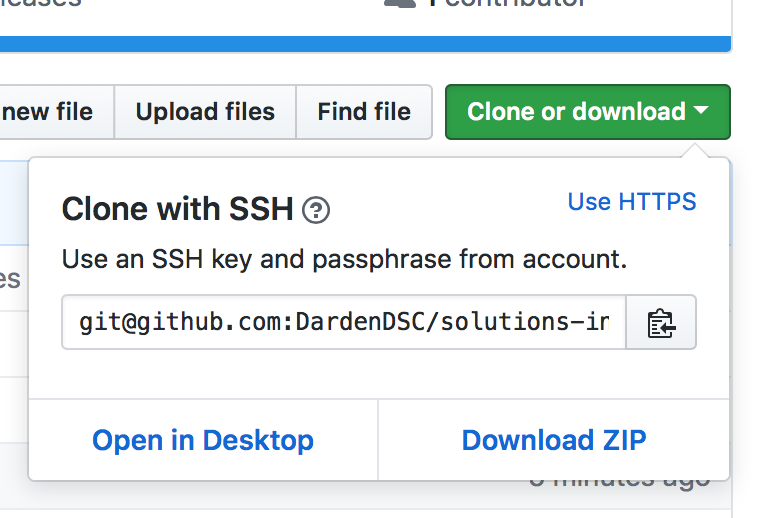
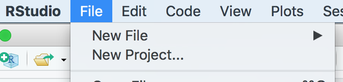
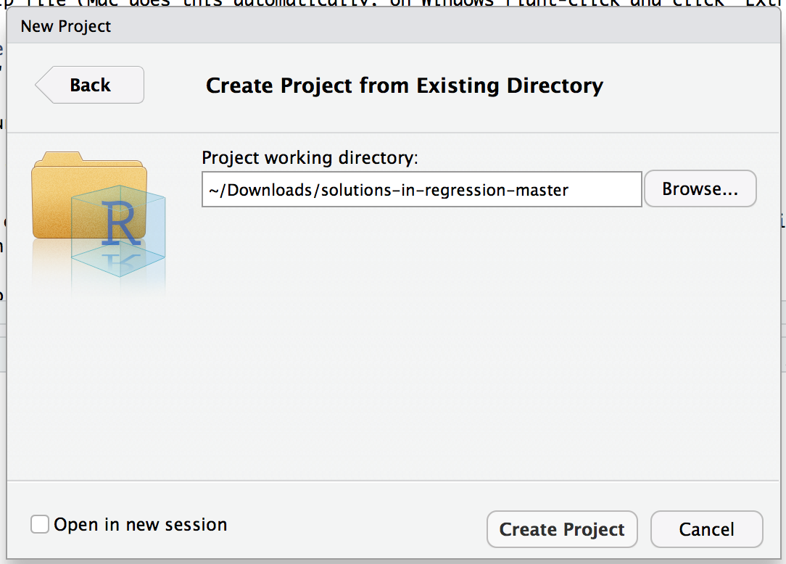
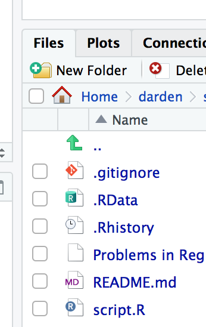
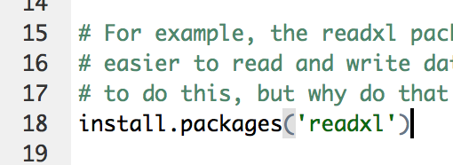

# Solutions in Regression
A repository containing one script ([`script.R`](script.R)) that shows how to 
perform regression analysis in the R programming language through different example 
problems. You will learn how to:  

   - Load data into R from an [Excel file](Problems%20in%20Regression%20QA-0416%20data.xls)
   - Fit a regression to the data
   - Interpret the output
   - Along with other programming concepts like variables, assignment, and more!
   
If you are just dying to get straight to the answers they are available in [solutions.md](solutions.md)

## Table of Contents
 - [Following Along](#following-along)
 - [Installing R and RStudio](#installing-r-and-rstudio)
 - [Installing R Packages](#installing-r-packages)
 - [Resources to Learn R](#resources-to-learn-r)
 - [Source](#source)
 
### Following Along
The best way to learn R is to try it out for yourself. After downloading [R](https://cloud.r-project.org) 
and [RStudio](https://www.rstudio.com/products/rstudio/download/#download), follow 
these steps to participate in the workshop.  

Step | Directions | Screenshot
---|---|---
&#35;1 | Go to https://github.com/DardenDSC/solutions-in-regression | 
&#35;2 | Click on the green `"Clone or download button"` and then click `"Download Zip"` |  
&#35;3 | On your computer extract the zip file (Mac does this automatically, on Windows right-click and click "Extract All") | 
&#35;4 | Open up RStudio and click `File -> New Project` |  
&#35;5 | Click `"From Existing Directory"` and click `"Browse"` to select the folder you just unzipped |  
&#35;6 | This will use the folder as your R Project, which just means that the folder is a central place to keep all your analysis for this situation | 
&#35;7 | In the bottom-left pane, click `"Files"` and select the file entitled `"script.R"` |  
&#35;8 | Now that you've got the script opened, you're all set to get started. Place your cursor at the end of a line and run it by pressing `CTRL+ENTER` (`CMD+ENTER` on Mac) |  

Keep reading for more information on how to set up your computer with R and RStudio.
 
### Installing R and RStudio
First, you can install R by going to https://cloud.r-project.org. You should see 
the options to download for Windows, Mac and Linux. Follow the command prompts on your 
screen just like you would install any other software.

Next, you should install RStudio. Wait, Why should I install RStudio too?  

When you installed R, you only installed the software. It is hard to code directly to the software, so 
RStudio is an interface (other software) that makes it easier to write R code and 
execute it. Go to https://www.rstudio.com/products/rstudio/download/#download and 
pick the installer for your operating system. Again, follow the prompts like you would 
install any other software on your computer. 

If you have trouble installing R or RStudio, contact a member of the Darden Data Science 
club to help you by emailing us at: DataScienceClub@darden.virginia.edu

### Installing R Packages
R uses "packages" of functions that people develop to that make it easier to read, 
format, and analyze data without writing many many lines of detailed code in order 
to do very simple tasks. We will use the **readxl** package to read data from the 
Excel file. Before using the package it must be installed by running the following 
command in the RStudio console.

```
install.packages("readxl")
```

### Resources to Learn R
Once you've installed R and RStudio you may want to review some materials 
to understand how to use it. The article [R basics, workspace and working directory, RStudio projects](http://stat545.com/block002_hello-r-workspace-wd-project.html) provides a 
very good introduction to using R.

The best book to learn R programming in called R for Data Science. It is available 
for free online at: http://r4ds.had.co.nz

### Source
The data was written by Phillip E. Pfeifer. It was written as a basis for class 
discussion rather than to illustrate an effective or ineffective situation. 
Copyright &copy; 1991 by the University of Virginia Darden School Foundation, Charlottesville, 
VA. All rights reserved. To order copies, send an e-mail to sales@dardenbusinesspublishing.com.

[Top](#solutions-in-regression)
