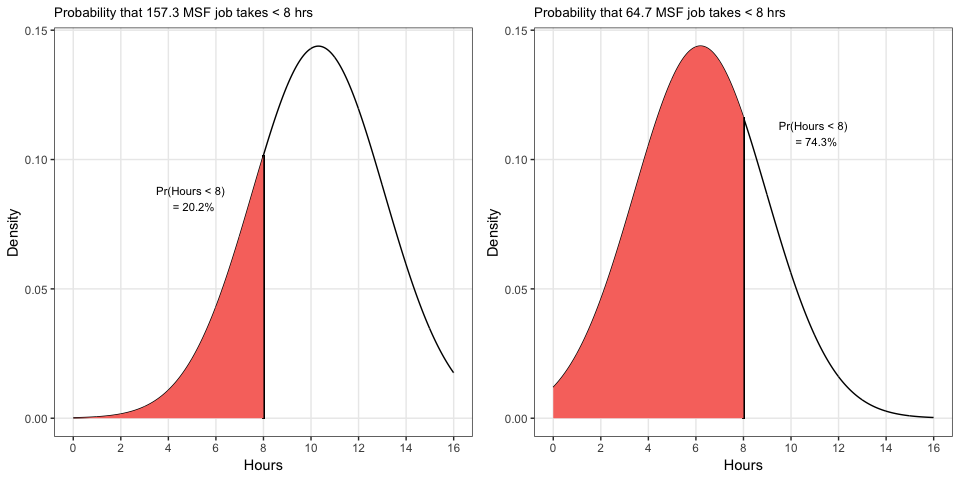

Solutions in Regression
================

**1. Union Camp-Trenton**: An important element in the scheduling
procedure of the Union Camp Corporation’s corrugated container plant in
Trenton, New Jersey, involved forecasting the amount of processing time
each job would require at each work center. Can regression be used to
provide a forecast? Two jobs waiting to be processed contained 157.3 MSF
and 64.7 MSF. What is the probability that the first, larger job will
take less than 8 hours to process? What is the probability that the
second, smaller job will take less than 8 hours?

**Answer**:

1.  There is a 20.2% chance that the first, larger job will take less
    than 8 hours.
2.  There is a 74.3% chance that the second, smaller job will take less
    than 8 hours.

We determined these numbers by creating a regression to predict the time
it would take for the two jobs. Then we used the standard error of the
regression (the typical variation around the predictions) to assuming
normality and calculate the area under the bell curve that represents
the probability less than 8 hours. See the figures below for a graphical
representation of what’s
happening.



**Code**:

``` r
prob1_data <- read_excel("Problems in Regression QA-0416 data.xls", 
                         sheet = "Prob 1",
                         range = "A3:B18")
trenton_regression <- lm(HOURS ~ MSF, data=prob1_data)
regression_standard_error <- summary(trenton_regression)$sigma
preds <- predict(trenton_regression, newdata = data.frame(MSF=c(157.3, 64.7)))
result <- pnorm(8, mean=preds, sd=regression_standard_error)
```

-----

**2. South Wales Mining Company**:

The South Wales Mining Company often needs to make rapid and exact
estimates of the weight of a pile of lose materials, such as coal. To
help do that more accurately, the company compiled information about 10
coal piles for which the actual weight was known. How should South Wales
Mining combine information in `D`, `h`, and `d` to predict the weight of
a pile of coal?

**Answer**:

We can make a regression using the raw data . However, the residuals
do not look normally distributed with mean zero. There is a weird
curvature. Remember that the volume of a cone is  so adding square terms for the top and bottom diameters
would make sense to correct for that, so the new equation
is:

<p align="center">


</p>

See the figures below for a graphical representation of what’s
happening.


**Code**:

``` r
prob2_data <- read_excel("Problems in Regression QA-0416 data.xls", 
                         sheet = "Prob 2",
                         range = "A3:D13")
wales_regression1 <- lm(W ~ D + h + d, data=prob2_data)
wales_regression2 <- lm(W ~ poly(D, 2) + h + poly(d, 2), data=prob2_data)
```

-----

**3. Longevity and Handedness**:

In the early 1990s, two psychologists surveyed the next of kin listed on
public death certificate records in two counties in Southern California.
The survey asked the handedness of the recently deceased family member.
Subjects were labeled right-handers, if they wrote, drew, and threw a
ball with their right hand. All other subjects were labeled as
left-handers. The age of death (AOD) of the 867 right-handers averaged
75.00 years. The AOD of the 82 left-handers averaged 66.03. What is your
explanation for the rather surprising results?

**Answer**:

The study collected data by finding people who died and asking their
family whether the deceased was right or left handed. Individuals who
were born much earlier and were left-handed had less of a tendancy to
report it and some experts even say that lefties were repressed in
earlier times. 11 percent of people today are left-handed yet according
to his research only 3 percent of people born in 1900 were. Therefore
anyone who was deceased and admitted to being left-handed was probably
born at a later time. Here is a chart depicting the rise of individuals
identifying as
left-handed:


-----

**4. Market Study**:

In a market-segmentation study, data on net income (`I`) in thousands,
family size (`F`), and expenditures on consumer durable goods (`C`) were
collected from 20 randomly selected households. The company sponsoring
the study was interested in isolating the effects of income and family
size on the dollar amounts spent for consumer durable goods.

**Answer**:

From the regression summary you can see that `Income` is statistically
significantly related to expenditures on consumer durable goods (*p* =
.0003). The positive coefficient of 228.2 for `Income` indicates that
expenditures rises as income rises (positively correlated). However,
`Family Size` is not is statistically significantly related (*p* =
.1258). Furthermore, it is has a negative coefficient of -288.0 which
indicates that expenditures decline as `Family Size` rises. This is the
effect of `Family Size` while already considering `Income` so it is
plausible that larger families earn more, but spend less per person
because of economies of scale and thriftiness in larger families.

    ## 
    ## Call:
    ## lm(formula = C ~ I + F, data = prob4_data)
    ## 
    ## Residuals:
    ##    Min     1Q Median     3Q    Max 
    ## -266.0 -186.8  -76.0  244.2  295.0 
    ## 
    ## Coefficients:
    ##             Estimate Std. Error t value Pr(>|t|)    
    ## (Intercept)   986.00     351.58   2.804 0.026354 *  
    ## I             228.20      35.16   6.491 0.000337 ***
    ## F            -288.00     165.74  -1.738 0.125830    
    ## ---
    ## Signif. codes:  0 '***' 0.001 '**' 0.01 '*' 0.05 '.' 0.1 ' ' 1
    ## 
    ## Residual standard error: 262.1 on 7 degrees of freedom
    ## Multiple R-squared:  0.9685, Adjusted R-squared:  0.9594 
    ## F-statistic: 107.5 on 2 and 7 DF,  p-value: 0.000005573

**Code**:

``` r
prob4_data <- read_excel("Problems in Regression QA-0416 data.xls", 
                         sheet = "Prob 4", 
                         range = "A3:C13")
consumer_regression <- lm(C ~ I + F, data=prob4_data)
summary(consumer_regression)
```

To prove that `Income` and `Family Size` are related we can calculate
Variance Inflation Factors (VIF) that give us a sense for whether our
inputs are too closely related to provide value and not confuse the
model intepretation. Anytime the square root of the VIF is greater than
2 would indicate “multicollinearity” (too much correlation) and both
variables have that problem as indicated below.

``` r
sqrt(vif(consumer_regression)) > 2
```

    ##    I    F 
    ## TRUE TRUE

-----

**5. Class Participation**:

There is a popular notion that students sitting on the right side (right
from a student’s perspective) of the classroom are called on more often
than students on the left. Use regression with a dummy variable to test
the notion that the average class participation grade is higher on the
right side of the class.

**Answer**:

From the regression summary you can see that being on the right-hand
side is not statistically significantly participation (*p* = .11).
However, this *p*-value is on the lower end, so it is possible that if
we collected more data that the relationship may prove to be
significant.

    ## 
    ## Call:
    ## lm(formula = y ~ x, data = prob5_data_reformatted)
    ## 
    ## Residuals:
    ##    Min     1Q Median     3Q    Max 
    ##   -9.9   -2.0   -0.6    2.8    9.7 
    ## 
    ## Coefficients:
    ##             Estimate Std. Error t value   Pr(>|t|)    
    ## (Intercept)   10.300      1.515   6.800 0.00000229 ***
    ## x              3.600      2.142   1.681       0.11    
    ## ---
    ## Signif. codes:  0 '***' 0.001 '**' 0.01 '*' 0.05 '.' 0.1 ' ' 1
    ## 
    ## Residual standard error: 4.79 on 18 degrees of freedom
    ## Multiple R-squared:  0.1356, Adjusted R-squared:  0.0876 
    ## F-statistic: 2.824 on 1 and 18 DF,  p-value: 0.1101

**Code**:

``` r
prob5_data <- read_excel("Problems in Regression QA-0416 data.xls", 
                         sheet = "Prob 5", 
                         range = "A3:B13")
prob5_data_reformatted <- data.frame(y = c(prob5_data$`Left Side`, 
                                           prob5_data$`Right Side`), 
                                     x = rep(c(0,1), each = nrow(prob5_data)))
participation_regression <- lm(y~x, data=prob5_data_reformatted)
summary(participation_regression)
```
